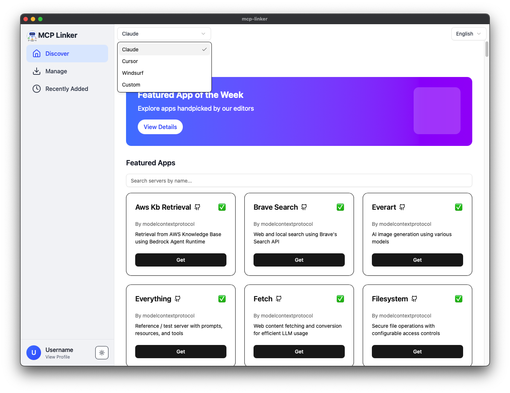
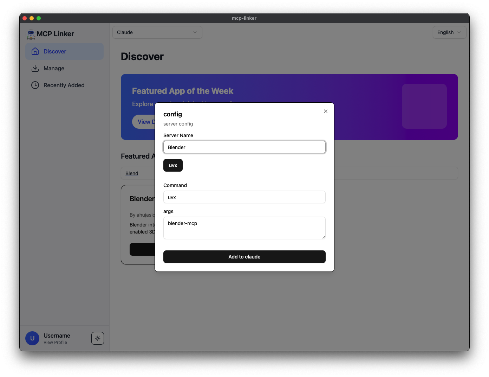
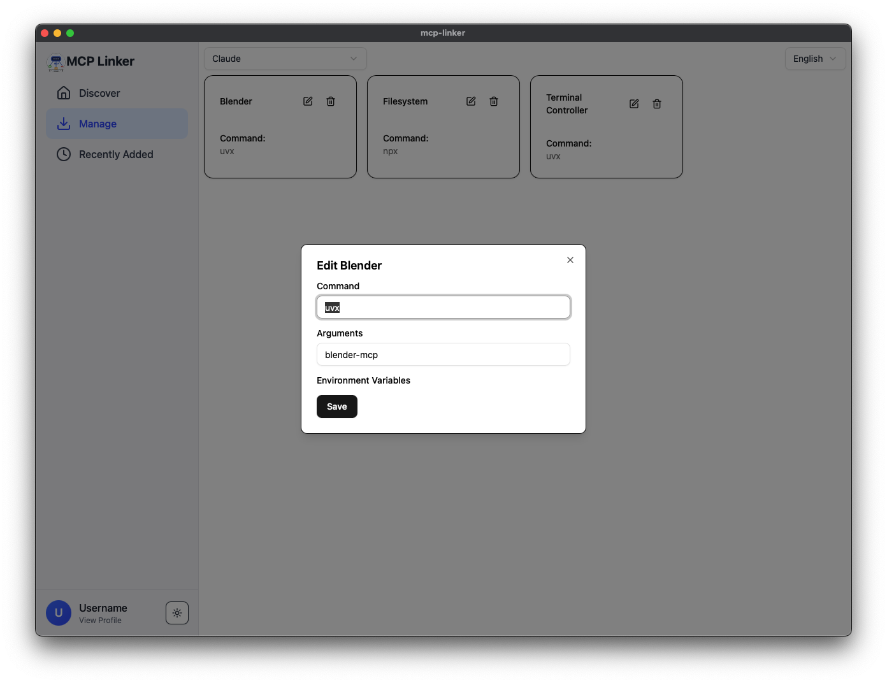

  

# MCP Linker

👉 [查看中文版本（简体中文）](./README.zh-CN.md)

Easily add a **Model Context Protocol (MCP) server** to your MCP client (**Claude Cursor windsurf...**) with just two clicks: **Get** and **Add**.

## Features

✅ One-click to add MCP servers  
✅ Supports multiple MCP server configurations  
✅ Open-source and community-driven  

## Quick Start

1. **Browse & Select**: Choose an MCP server from the available list.  
2. **Install**: Click **"Get"** to show configure of server.  
3. **Activate**: Click **"Add"** to integrate it with your MCP client.  

## Official Servers

Check out the list of [official MCP servers](https://github.com/modelcontextprotocol/servers).

## Screenshots

### Server Discovery

### Configuration Example

### Manage Example

## Contributing

We welcome contributions! To add your own MCP server:

1. **Fork & Clone** this repository.
2. **Submit a Pull Request** with your changes.

## License

BSD
