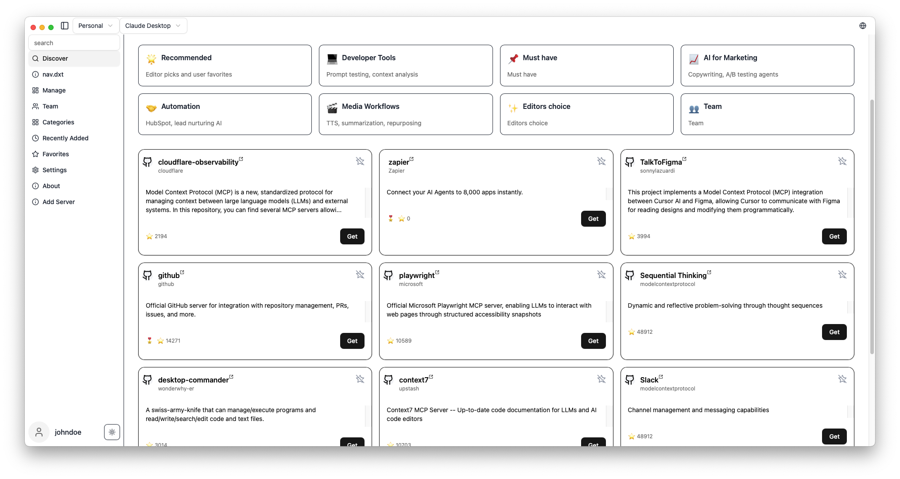

# MCP Linker

[](https://github.com/milisp/mcp-linker/releases)
[](https://github.com/milisp/mcp-linker/stargazers)
[](https://github.com/milisp/mcp-linker/network/members)
[](CONTRIBUTING.md)

[中文](readme/README.zh-CN.md) | [🌍 Other Languages](./readme/) • [💬 Discussions](https://github.com/milisp/mcp-linker/discussions) • [🐛 Issues](https://github.com/milisp/mcp-linker/issues) •  [💡 Ideas](https://github.com/milisp/mcp-linker/discussions/categories/ideas)

**One-click add and sync MCP servers across AI clients — No LLM calls needed**

> [!TIP]
> **⭐ Star the repo and follow [milisp](https://x.com/lisp_mi) on X and [github](https://github.com/milisp) for more**.


## 🚀 Why MCP Linker?

**Instant Setup**: Click → Add → Done. No manual config editing or LLM calls required.

Unlike tools like Cline that need LLM integration just to add MCP servers, MCP Linker provides direct, instant configuration management.

## News

- **build-in mcp chat** - AI Finder/explorer @files from FileTree + notepad. powered by [**milisp/plux**](https://github.com/milisp/plux)

## ✨ Features

- **Local Sync** — Sync mcp server config across Multi-Client
- **600+ Curated MCP Servers** — Built-in marketplace with sequential-thinking, desktop-commander, and more
- **Multi-Client Support** — Claude Desktop/Code, Cursor, VS Code, Cline, Windsurf. [see Detail](./docs/clients.md)
- **Cross-Platform** — macOS, Windows, Linux (~6MB)
- **Smart Detection** — Auto-detect Python, Node.js, uv environments
- **Cloud Sync** — Optional encrypted sync across devices (Pro)

## 🚀 Quick Start

1. **[📥 Download](https://github.com/milisp/mcp-linker/releases)** the latest release
2. **Browse** MCP servers in the built-in marketplace
3. **Click "Get"** to show configuration
4. **Click "Add"** to install to your selected client
5. **Done!** Start using new AI capabilities immediately

### Try It Now
[](https://www.mcp-linker.store/install-app?name=sequential-thinking&autoSubmit=true&config=eyJzZXF1ZW50aWFsLXRoaW5raW5nIjp7ImNvbW1hbmQiOiJucHgiLCJhcmdzIjpbIi15IiwiQG1vZGVsY29udGV4dHByb3RvY29sL3NlcnZlci1zZXF1ZW50aWFsLXRoaW5raW5nIl19fQ==)

## Screenshots

| Server Discovery | Add Configuration |
|-----------------|-------------------|
|  |  |

## Installation Notes

### macOS Users
If you see "App is damaged" message:
1. Go to System Preferences → Security & Privacy
2. Click "Open Anyway"
Or run: `xattr -d com.apple.quarantine /path/to/MCPLinker.app`

[📺 Video Guide](https://www.youtube.com/watch?v=MEHFd0PCQh4)

## What's MCP?
Model Context Protocol is like USB-C for AI — a standard way to connect AI models to different data sources and tools.

## 🧭 Related Projects

Check out [**awesome-claude-dxt**](https://github.com/milisp/awesome-claude-dxt) — a curated list of Claude Desktop Extensions (dxt), tools, and resources

## 💬 Community & Support

- [💬 Join Discussions](https://github.com/milisp/mcp-linker/discussions)
- [🐛 Report Issues](https://github.com/milisp/mcp-linker/issues)
- [☁️ Pro Plans](https://mcp-linker.store/pricing) — Cloud sync starting at coffee price/month

## 🛠️ Development

**Requirements:** Node.js 20+, Bun, Rust, [Tauri prerequisites](https://v2.tauri.app/start/prerequisites/)

```bash
git clone https://github.com/milisp/mcp-linker
cd mcp-linker/tauri-app
bun install
cp .env.example .env
bun tauri dev
```

## License
MIT License - see [LICENSE](LICENSE)

---
**Found this helpful? Please ⭐ the project!**

## 📈 Star History

[](https://star-history.com/#milisp/mcp-linker)