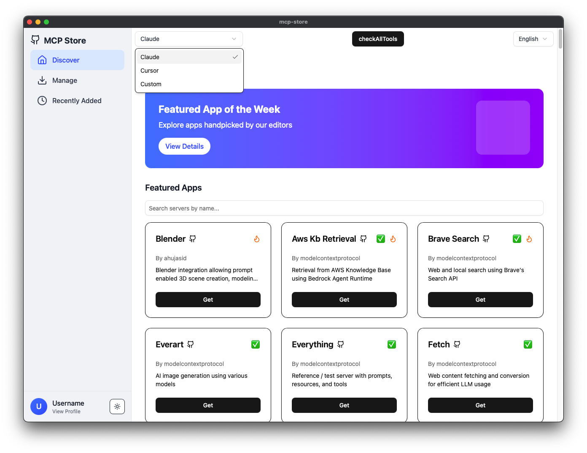
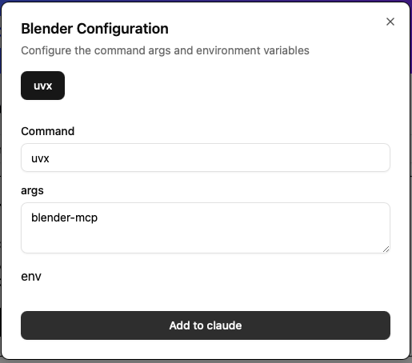

# MCP Store

Easily add a **Model Context Protocol (MCP) server** to your MCP client (**Claude Cursor**) with just two clicks: **Get** and **Add**.

## Features

✅ One-click installation of MCP servers  
✅ Supports multiple MCP server configurations  
✅ Open-source and community-driven  

## Quick Start

1. **Browse & Select**: Choose an MCP server from the available list.  
2. **Install**: Click **"Get"** to download and configure the server automatically.  
3. **Activate**: Click **"Add"** to integrate it with your MCP client.  

## Official Servers

Check out the list of [official MCP servers](https://github.com/modelcontextprotocol/servers).

## Screenshots

### Server Discovery


### Configuration Example


## Contributing

We welcome contributions! To add your own MCP server:

1. **Fork & Clone** this repository.  
2. **Add Your Server**: Place your project in the `servers` folder.  
3. **Define Your MCP Server**: Add an `mcp.json` file with the following structure:

   ```json
   {
     "mcpServers": {
       "example-mcp": {
         "command": "uvx",
         "args": ["example-mcp"]
       }
     }
   }
   ```
4. **Submit a Pull Request** with your changes.

## License

MCP Store is open-source and licensed under BSD License.
