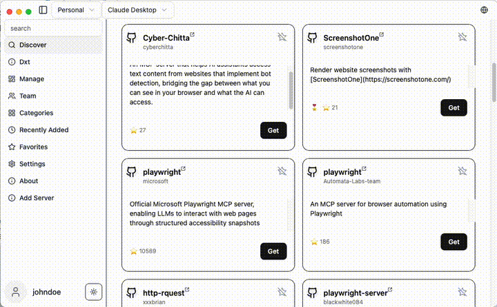
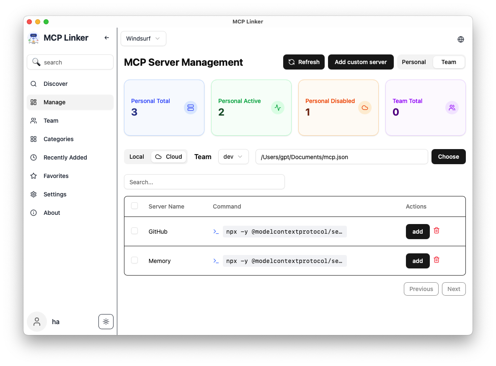

# MCP Linker

<div align="center">

Add, manage, and sync MCP (Model Context Protocol) servers across AI clients like Claude Desktop, Cursor, and Cline — all via a lightweight Tauri GUI with a built-in MCP server marketplace.


[中文](./docs/README.zh-CN.md) | [es](./docs/README.es.md) | [日本語](./docs/README.ja-JP.md) | [繁體中文](./docs/README.zh-Han.md)

⚡️ **Say goodbye to copy-paste**

[](https://github.com/milisp/mcp-linker/stargazers)
[](https://github.com/milisp/mcp-linker/releases)
[](https://github.com/milisp/mcp-linker/releases)

### 🌟 **Love this project? Give us a star!** 🌟

---

### 🚀 Get Started in 30 Seconds

[📥 **Download Now**](https://github.com/milisp/mcp-linker/releases) • [🚀 Quick Start](#quick-start) • [💬 Join Discord](https://discord.gg/UqXeVqUKQq)

</div>

---

### ☕ Buy Me a Coffee

If you like MCP Linker, consider buying me a coffee to support continued development ❤️

[](https://coff.ee/wei40680f)

---

## ✨ Why Choose MCP Linker?

**The fastest way to supercharge your AI workflow**



### 🎯 Key Features

- **🚀 One-Click Installation** — No more manual config file editing
- **🔄 Multi-Client Support** — Claude Desktop, Cursor, VS Code, Cline, Roo Code, Windsurf, and more
- **📦 600+ Curated Servers** — The build-in MCP server marketplace
- **🌐 Cross-Platform** — macOS, Windows, Linux (lightweight ~6MB)
- **🔍 Smart Detection** — Auto-detect Python, Node.js, UV environments
- **⚡ Built with Tauri** — Fast, secure, and resource-efficient

### 💎 Game-Changing Benefits

- Sync MCP server configuration across all your MCP clients.
- Pro users get 🔐 Encrypted Cloud Sync.
- Team collaboration features!**

## 🚀 Quick Start

**Get up and running in under a minute:**

1. **[📥 Download the latest release](https://github.com/milisp/mcp-linker/releases)**
2. **🔍 Browse** our curated MCP server marketplace
3. **➕ Click "Add"** to install and configure automatically
4. **🎉 Done!**

> **💡 Pro Tip:** Star this repo to stay updated with new MCP servers and features!

## 🚀 Upgrade to MCP-Linker Pro or Team

Access cloud sync, and more!  
👉 [View Tiers & Subscribe](https://mcp-linker.store/tiers)

## 📸 Screenshots

| Manage | 🔍 Server Discovery | ⚙️ Configuration |
|---------------------|---------------------|------------------|
|  |  |

---

## 🛠️ Development

```bash
git clone https://github.com/milisp/mcp-linker
cd mcp-linker
bun install
cp .env.example .env
bun tauri dev
```

**Requirements:** Node.js 20+, Bun, Rust toolchain

---

## 🏗️ Architecture

- **Frontend:** Tauri + React + shadcn/ui
- **Backend:** Optional FastAPI

---

## 🤝 Contributing

We welcome contributions! See [CONTRIBUTING.md](./CONTRIBUTING.md) for details.

**Found this helpful? Consider giving us a ⭐ to support the project!**

---

## 💬 Support & Community

- **[💬 Join our Discord Community](https://discord.gg/UqXeVqUKQq)** — Get help, share ideas, and connect with other users
- **[🐛 Report Issues](https://github.com/milisp/mcp-linker/issues)** — Help us improve

---

## 🎉 Amazing Contributors

We're grateful to our awesome community contributors who make MCP Linker better every day:

[](https://github.com/milisp/mcp-linker/graphs/contributors)

**Special thanks to:**
- [@eltociear](https://github.com/eltociear) — Japanese translation
- [@devilcoder01](https://github.com/devilcoder01) — Windows build compatibility, UI improvements, GitHub workflows 🛠️
